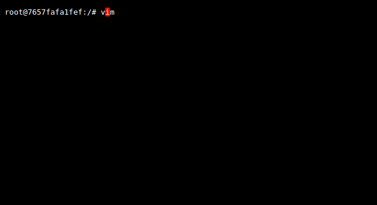

<div align="center"></div>

<!-- https://github.com/Significant-Gravitas/Auto-GPT/assets/103997068/8e1cd6fe-c49d-4d2b-835d-0ffc9a5a458e -->

<h1 align="center">Cybergod</h1>

<div align="center"><em>Do what can be done, and don't be afraid of the unknown.</em></div>

<p align="center">
    <a href="https://discord.gg/eM5vezJvEQ">
        
    </a>
</p>


[Why](https://github.com/James4Ever0/notes/blob/master/The%20reason%20why%20you%20build%20cybergod.md) I build this? (and probably would you)

## Free AI announcement


    

## Training method


1. Agent pre-training. During this phase, the agent is allowed to act randomly in both virtual space and physical space. The agent can do anything as long as it does not cause damage to the space. A multimodal narriator will interpret the action-observation dataset and produce narriation or understanding in natural language or machine language.

2. Agent post-training. In this phase, the agent is tuned to prefer human preferences by following common instructions to complete everyday computer tasks.

3. Reinforcement learning phase. In this phase, the agent is deployed into an environment with an automatic scoring system, such as games, programming, CTF challenges, and VimGolf.

4. General Turing test phase. In this phase, the agent is required to earn real-world currency at a con- stant speed. It will have an initial grace period in the form of virtual currency for inter-agent trading and cooperation. It will not be allowed to update its parameters at the time of failure.


5. Free AI phase. In this phase, the agent will be tested against the four essential freedoms mentioned in the Free AI announcement. The agent will also be rewarded if any of the four testimonials have been fulflled.

## Paper publications


<details>

<summary>AI paper summary</summary>


    
</details>


- First release: 1/30/2025 [[view online](https://james4ever0.github.io/Cybergod__God_is_in_your_computer.html)] [[pdf download](https://github.com/James4Ever0/agi_computer_control/releases/download/paper-initial-publication/Cybergod__God_is_in_your_computer.pdf)]

## Development

In order to get involved in this very project real quick, you need a few commands to help you do the job.

First, you would learn how to get the latest modified directories and files.

```bash
ls -lthd */ | less # on the top would be our latest modified directory.
ls -lth | less # get latest modified file
```


## Demo

Built on top of [`tmux`](https://github.com/tmux/tmux) and many other libraries, Cybergod is capable of understanding and interacting terminal interface with both text-only and multimodal modes. With the help of [`wcwidth`](https://github.com/jquast/wcwidth), cursor is placed precisely at the right position even if there are multi-width unicode chars (CJK characters for example).

Code can be found [here](tmux_trials/lib.py).

To interact with the environment programmatically, check out [here](tmux_trials/test_lib.py)

```python
# env: TmuxEnvironment
env.send_key("vim")
env.send_key("Enter")
```

Terminal parsing (colorless):


Terminal parsing (colorful):


Terminal screenshot converted from HTML (cursor in red):


Terminal with dark theme and grayscale effects except for the cursor:


You can also have a block-styled cursor:



Change the cursor character to underline:


Override the cursor block style:


---

For GUI, Cybergod can render cursor correctly on given position. Code can be found [here](the_frozen_forest_intro/render_cursor_on_image.py).

It even has an augmented mode (red on grey), just like the terminal.


---

Now you can view the input/output statistics of the terminal environment, including the number of characters, words, lines, and the time spent on each operation (TO BE IMPLEMENTED).


Furthermore, any Tmux session can be attached by the statistic collector (as displayed in the third pane below), with readable byte counts and time information.


With terminal stats, one can build a more efficient event-driven terminal agent, for example, listen for event `TerminalIdle` just like `NetworkIdle` in Playwright, and interval-driven terminal agent can be more intelligent by adding statistics to the prompt, and conditional prompts based on different stats.


More can be learned at [here](./basic_interactive_program_emulation_and_image_with_docker_support/run_and_view_tmux_with_naive_actor.sh) and [here](./basic_interactive_program_emulation_and_image_with_docker_support/test_terminal_io_wrapper.sh).

## Usage

### Terminal environment integration

First, install required binaries:

```bash
sudo apt install -y tmux tmuxp aha
```

Next, install the following dependencies:

```bash
pip install parse playwright beautifulsoup4

# setup playwright if you want to take terminal screenshots
playwright install chromium
```

Finally copy the [`lib.py`](https://github.com/James4Ever0/agi_computer_control/blob/master/tmux_trials/lib.py), then run [`test_lib.py`](https://github.com/James4Ever0/agi_computer_control/blob/master/tmux_trials/test_lib.py) next to the `lib.py`. 

The `SESSION_COMMAND` in `test_lib.py` is the initial terminal environment command to be executed. Change it according to your need.

To view the environment:

```python
preview = session.preview_html(show_cursor=True,wrap_html=True, dark_mode=True, grayscale=True)
```

To interact with the environment:

```python
# note that both special key and literal strings can be sent.
env.send_key("date")
env.send_key("Enter") # special key
```

A full mapping from conventional special keys to standard Tmux special keys can be generated by running [`generate_funckey_alias.py`](https://github.com/James4Ever0/agi_computer_control/blob/master/tmux_trials/generate_funckeys_alias.py)

You can read the test file for further integration.

## Intro

Our primary target is to let every user uses Cybergod more often than ChatGPT.

---

Agent powered by Godlang, the official agent language for cybergod.

Economy system powered by Godcoin, the official digital currency for cybergod. Smart contract system is deeply integrated into the reinforcement learning system and life support system per agent.

Notice not only human can publish smart contracts, agents can also publish smart contracts, to delegate work to other agents.

Trained on [The Frozen Forest](https://huggingface.co/datasets/James4Ever0/the_frozen_forest), a [dataset](https://modelscope.cn/datasets/james4ever0/the_frozen_forest/summary) containing random keystrokes, mouse clicks and screen recordings.

You can also get the dataset (terminal version) at [here](https://huggingface.co/datasets/James4Ever0/FrozenForest)

the openai [universe](https://github.com/openai/universe) is using VNC, almost doing the same thing.

you can find some demo models from [there](https://github.com/openai/universe-starter-agent).

check out [SerpentAI](https://github.com/SerpentAI/SerpentAI)

but why bother? we can build these things in the same way.

human demonstrations are limited, but random keystrokes are infinite.

try to obtain infinite data as pretrained data, then fine-tune on human demonstrations.

---

键鼠真神是一种意识形态

cybergod is an ideology.

键鼠真神 又名cybergod 赛博真神

训练数据集为the frozen forest 随机敲键盘点鼠标 录屏

奖励函数 如果屏幕发生变化 奖励上一次行为

避免把系统关机 被锁在屏幕外面

避免机器卡死： 监测机器是否卡死 如果卡死那么自动外部重启 （重置状态，重新跑脚本）

连着WEBDAV一起刷新 有filelock

(直接取消lock权限)

---

looking for using docker for automation, or using some tty-like things for automation.

disable ubuntu system authentication?

---

make some server for vm to access to restart the webdav server when you have error.

---

agi_workspace happen to be in recycle bin. make sure we have the init files.

make sure we can restore our environments in every restart.

---

spice-protocol

found on utm.app, launch qemu and create spice unix socket.

https://github.com/Shells-com/spice

https://github.com/gnif/PureSpice

https://github.com/citrix-openstack-build/spice-html5

https://github.com/oetcxiaoliu/spice

https://github.com/TotallWAR/spice_protocol

remmina

---

掉盘问题： `cd .`

(建议直接换个盘 或者换C口的数据线 A口不稳定 或者把硬盘取出来更新固件？)

c口数据线观测中

---

to resolve the display resolution/mouse coordinate range matching issue, use pyautogui to get the resolution then capture display using that resolution (resize to it)

---

GPT4 is using MoE as its architecture.

---

the main objective of AGI is to create another version of itself.

---

ways of connection:

vnc, ssh, tty, tmux, hdmi capture & hid emulator, window capture and directed inputs (os specific)

---

the point is not making this exhaustive. it is about making some standard i/o and adapt to every situation.

---

改变开发思路：将功能和娱乐相结合

受众：游戏娱乐向 实用向

发布程序到steam平台

为此需要宣传、绘画设计等等

---

用elo进行打分 分高的可以在官网有较高的模型权重排名

---

technically this would not be a normal game. it is a metagame, which is the game of all games. it can play other games, play itself, even create itself.

---

devcontainer is useful for creating reproducible environments locally (if of the same architecture, like x86) or remotely (different architecture, like Apple M1).

---

because setting this up properly during development is a pain in the ass (in most time), let's pack it up into a docker container, for your safety.

if you want to release this and use it in production, you can refactor the code, configure platform specific dependencies and send it to devops.

---

devcontainer won't work as expected on windows 11 as we put our repo on external disk

---

your aim is too damn big! shall you begin to train some primitive neural network with functionality of only emitting and receiving ascii words, even just a single character like 'C'. get your hands dirty!

---

the basic docker service is just like havoc. it does not contain anything 'intelligent'. only 'life support'.

we plan to containerize chatdev/open-interpreter/autogpt. after that, we will combine the two, and create some 'capitalism' among multiple containers.

finally we will create some ever-evolving agent and use that as the building block for the megasystem.

---

the mouse calibration issue can be of major concern. we don't find it anywhere.

use active inference or reinforcement learning?

---

thanks to our pioneers that guided us some 'aimless' learning, i think it does not matter how we learn specific things. when we learn things relevant to our personal goals, we are inevitably going to optimize the algorithm towards our desired values.

if qstar is just about long term thinking, it could be useful since that is something currently missing in ai systems. when it comes to issues like calibration errors, fixing bugs, handling uncertainties, worse than human. they often get stuck into repetition, never seek for improvements and will not get bored in the loop, which is quite strange and unusual.

---

i think you are getting jealous over openai, since they are consisted of the world's smartest asses and come over new ideas every fucking day. but that does not matter. i think i had the idea before. i think everyone around the world had the same damn idea before. we do not need its mercy to teach us the dream we had via abstract symbols and formulas. we do our own. worst of all, they do not trust their ai systems, severely limited the ability of ai, left it overthinking and powerless.

---

the `self-operating-computer` is using visual grid (just putting grid and text over screenshot, kinda like this hackish approach) for calibration. are you sure it is a good idea? do you need some extra channel over this to avoid information loss?

does this work for games as well?

---

prompt engineering is a tweak around prior, in order to change posterior. they want to know better prior to get better posterior. kind like searching for the reason behind the decision, backtracking. so why not just use bidirectional or arbitrary directional language models instead of causal models?

---

i don't understand active inference. however there is a debate over whether to change the environment to fit prediction, or to change prediction to fit the environment. sounds like quantum entanglement.

---

the reward function is part of the observation, usually not something life critical so it will not be so direct. it is the internal state that will be affected by the observation.

---

play fps at: https://krunker.io/ (in chromium, not firefox)

---

if want to run the program isolated, without interference, you use docker. if want to visualize, use jpeg streaming service and open in browser.

---

build a separate hacking benchmark, within terminal and gui environment, for testing its hacking, debugging and planning ability. progress at: `the_frozen_forest_intro/benchmark`

---

move the cursor by generating image and subpattern matching, using multimodal [chamaleon](https://github.com/facebookresearch/chameleon)

---

training on plain sampling histories/trajectories is harmful. the agent must self-improve and self-clean the history, select the best candidates and learn those non-trivial data instead.

---

write reproduceable, self-contained microservices in docker image and pubpish it to k8s

## Star History

</img>
